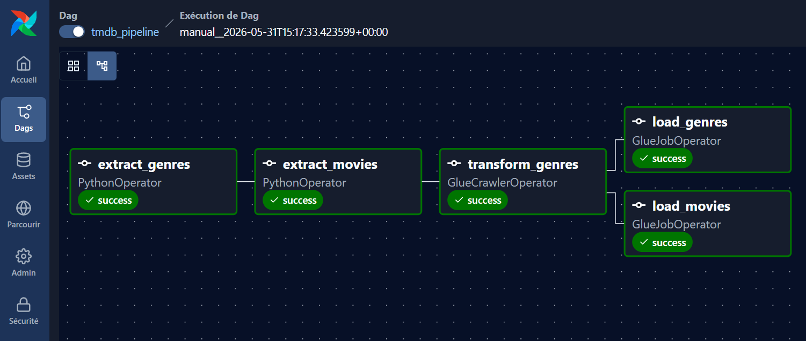

# 🎬 TMDB ETL Pipeline

> End-to-end data engineering pipeline collecting, transforming and analysing movie data from The Movie Database (TMDB) API.


---

## Architecture

```
TMDB API
   │
   ▼
Python Extract
   │  raw JSON
   ▼
AWS S3 — tmdb-etl-raw-dev
   │
   ▼
AWS Glue
   │  cleaned Parquet
   ▼
AWS S3 — tmdb-etl-processed-dev
   │
   ▼
Snowflake
   │  staging tables
   ▼
dbt
   │  dimensional models
   ▼
Analytics
```

---

## Stack

| Layer | Technology | Role |
|---|---|---|
| Extract | Python + Requests | TMDB API client |
| Storage | AWS S3 | Raw & processed data lake |
| Transform | AWS Glue | JSON → Parquet cleaning |
| Orchestration | Apache Airflow | Pipeline scheduling |
| Warehouse | Snowflake | Analytical storage |
| Modelling | dbt | SQL transformations & tests |

---

## Project Structure

```
tmdb-etl-pipeline/
├── dags/                  # Airflow DAGs
├── etl/
│   ├── extract/           # TMDB API client
│   ├── transform/         # Data transformations
│   └── load/              # Snowflake loader
├── glue_jobs/             # AWS Glue scripts
├── dbt/                   # dbt models & tests
├── tests/                 # Unit tests
├── utils/                 # Shared utilities (S3, HTTP)
├── .env.example           # Environment variables template
├── docker-compose.yml     # Airflow local setup
└── requirements.txt
```

---

## Getting Started

### Prerequisites

- Python 3.12+
- AWS account with S3 access
- TMDB API account

### Installation

```bash
git clone https://github.com/Boutzi/tmdb-etl-pipeline.git
cd tmdb-etl-pipeline

python -m venv .venv
source .venv/bin/activate  # Windows: .venv\Scripts\activate

pip install -r requirements.txt
```

### Configuration

```bash
cp .env.example .env
# Fill in your credentials in .env
```

```env
TMDB_READ_ACCESS_TOKEN=
AWS_ACCESS_KEY_ID=
AWS_SECRET_ACCESS_KEY=
AWS_REGION=eu-west-3
S3_BUCKET_RAW=tmdb-etl-raw-dev
S3_BUCKET_PROCESSED=tmdb-etl-processed-dev
AIRFLOW_UID=
FERNET_KEY=
```

### Run

```bash
# Extract & load to S3
python -m etl.extract.tmdb_client
```

---

## Roadmap

- [x] Project structure & conventions
- [x] AWS S3 buckets & IAM setup
- [x] TMDB API extract (genres + 10K movies)
- [x] Raw upload to S3 Data Lake
- [x] AWS Glue transform (JSON → Parquet)
- [x] Apache Airflow orchestration (Docker)
- [ ] Snowflake Data Warehouse setup
- [ ] dbt dimensional models & tests
- [ ] Analytical queries & insights

---

## Data Sources

- **TMDB API** — [developers.themoviedb.org](https://developers.themoviedb.org)
- Endpoints: `/genre/movie/list`, `/discover/movie`, `/movie/changes`
- ~10 000 movies, full load + incremental updates every 3 days

---

## Pipeline en action



*Built as a data engineering portfolio project.*